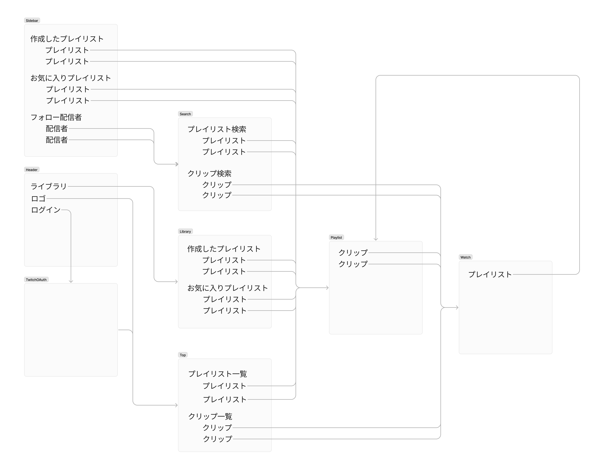
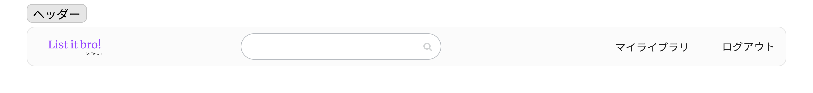
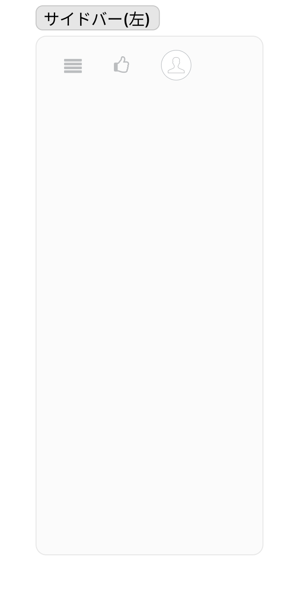
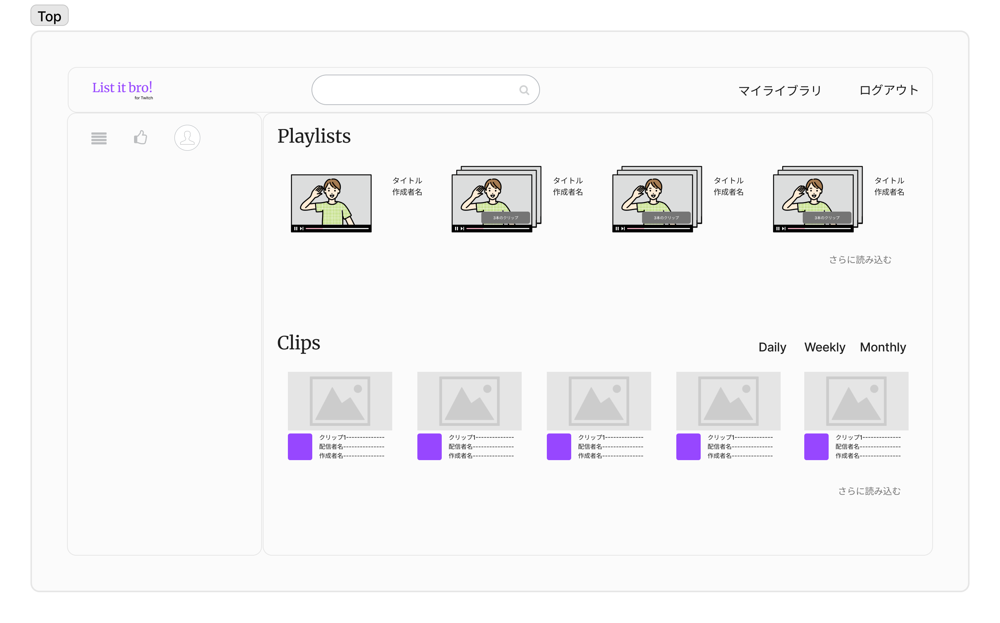
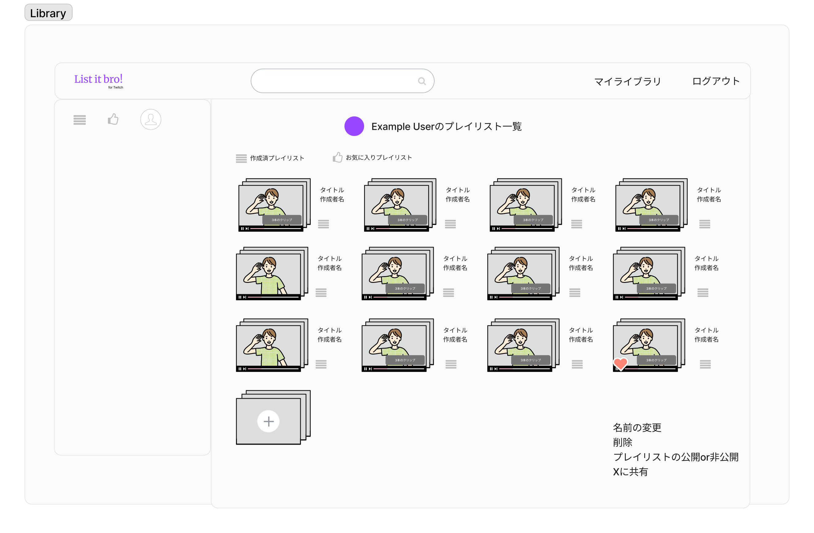
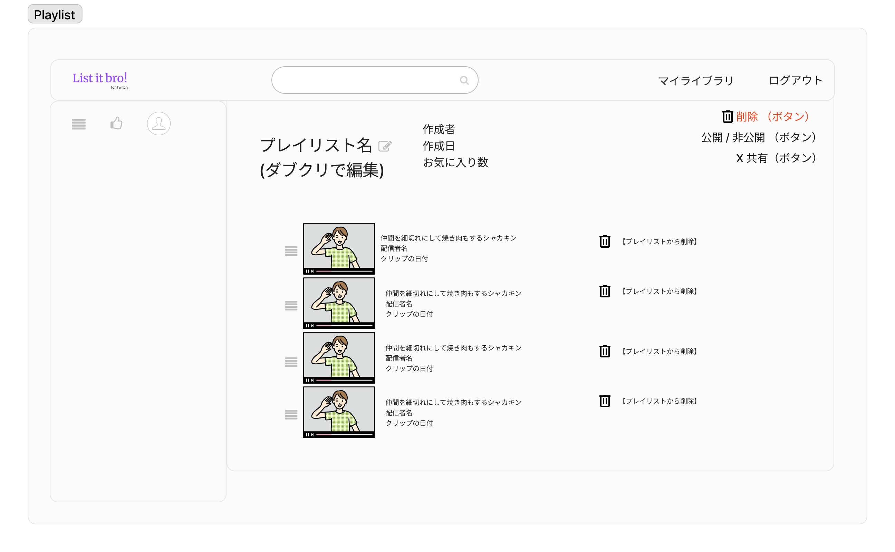
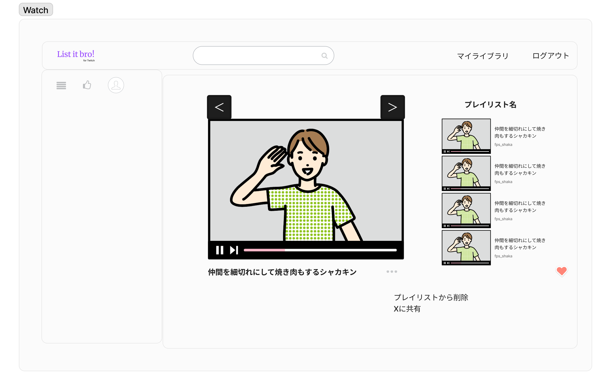
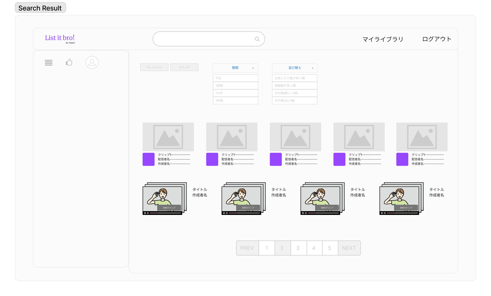
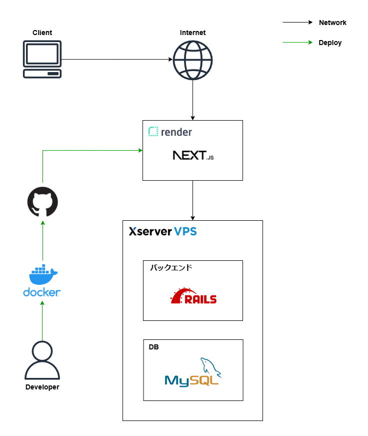

# 設計
## 業務フロー
### プレイリスト作成者

### プレイリスト閲覧者

## 画面遷移図

## ワイヤフレーム
### ヘッダー

**機能**
* サービスロゴをクリックすると、*TOP*へ遷移
* 虫眼鏡をクリックすると、入力された情報を検索ワードとし*SearchResult*に遷移
* ログインログアウト
* 自分の*Library*に遷移

**データ**
* ログイン中のユーザー情報

### サイドバー

**機能**
* 作成したプレイリスト一覧ボタンを押すと、プレイリスト一覧が表示される
* お気に入りプレイリスト一覧ボタンを押すと、お気に入りプレイリスト一覧が表示される
* フォロー配信者一覧ボタンを押すと、フォロー配信者一覧が表示される

[作成したプレイリスト一覧]
* 作成したプレイリストの一覧を表示
* *Playlist*へ遷移できる
* プレイリストの並び順は、作成日の新しい順

[お気に入りプレイリスト一覧]
* お気に入りプレイリストの一覧を表示
* *Playlist*へ遷移できる
* プレイリストの並び順は、作成日の新しい順

[フォローした配信者一覧]
* 自分がフォローしている配信者一覧が表示される
* 配信者名をクリックすると、*Search*のその配信者でソートした結果に遷移する

**データ**
* 自分が作成したプレイリストの情報
* 自分がお気に入りしたプレイリストの情報
* 自分がフォローしている配信者の情報

### トップ(/)

**機能**
* TOP画面を表示
* プレイリストをクリックすると*Playlist*へ遷移
* クリップをクリックすると*Watch*へ遷移
* クリップのDaily, Weekly, Monthlyをクリックすると、指定したランキングを表示

**データ**
* 1週間以内に作成されたプレイリストの中で、お気に入り数が多いものの情報
* クリップ視聴数のDaily, Weekly, Monthlyランキング情報

### ライブラリ(/users)

**機能**
* 共通
  * プレイリストの一覧を表示
  * ユーザー名の表示
  * プレイリストをXに共有
  * *Playlist*へ遷移できる
  * プレイリストの並び順は、作成日の新しい順
* 自分のライブラリのとき
  * タブでお気に入りと作成したプレイリストを切り替え
  * プレイリストの公開非公開
  * プレイリスト削除
  * プレイリストの名前の変更
* 他人のライブラリのとき
  * プレイリストをお気に入りに追加・解除

**データ**
* 自分が作成したプレイリストの情報
* 自分がお気に入りしたプレイリストの情報

### プレイリスト(/playlists)

**機能**
* クリップ一覧を表示
* Clip Playに遷移するときにPlaylistのクリップ一覧データを渡す
* プレイリスト名の編集
* プレイリストの削除
* クリップの削除
* クリップの並べ替え(ドラッグアンドドロップ)
* プレイリストをXに共有
* 公開非公開の設定
* プレイリストのデータを表示

**データ**
* プレイリストの情報
* 属する先頭クリップのサムネイル画像
* 属する先頭クリップのID

### クリップ(/watch)

**機能**
* 共通
  * 指定したクリップを表示
  * →をクリックすると、次の(前の)クリップを表示
  * 「Xに共有」をクリックすると、Xの画面を表示
  * 画面右のクリップをクリックすると、指定したクリップを表示
* 自分のプレイリスト
  * 画面右にクリップの属するプレイリストを表示
  * 「プレイリストから削除」をクリックすると、プレイリストからクリップを削除する。
  *  「ハートマーク」をクリックすると、お気に入りに追加
* 他人のプレイリスト
  *  画面右にクリップの属するプレイリストを表示
  *  「プレイリストに追加」をクリックすると、プレイリストを指定してクリップを追加
  *  「プレイリストを作成して追加」をクリックしたとき、プレイリスト名を指定して作成し、そのプレイリストにクリップを追加
  *  「ハートマーク」をクリックすると、お気に入りに追加
*  プレイリスト情報無し
   *  画面右にWeeklyランキングを表示
   *  「プレイリストに追加」をクリックすると、プレイリストを指定してクリップを追加
   *  「プレイリストを作成して追加」をクリックしたとき、プレイリスト名を指定して作成し、そのプレイリストにクリップを追加

**データ**
* クリップの情報
* (あれば)属しているプレイリストのID

### 検索(/search)

**機能**
* プレイリストとクリップを選択するボタンがある
  * デフォルトはプレイリストのみの表示で、ボタンを押すことでプレイリストのみの表示とクリップのみの表示を切り替え
* 期間の指定(1週間, 1カ月, 1年間, 全期間)をするプルダウンがある
  * デフォルトは1週間で、選択することで表示するデータの期間を切り替え
* 並び替えの指定(お気に入り数が多い順, 視聴数が多い順, 新しい順, 古い順)をするプルダウンがある
  * デフォルトはプレイリストならお気に入り数が多い順、クリップなら視聴数が多い順で、選択することで表示するデータの順番を切り替え
  * お気に入り数が多い順はプレイリスト、視聴数が多い順はクリップを表示しているときしか選択できない
* プレイリスト/クリップの一覧を表示
* プレイリストをクリックすると*Playlist*に遷移
* クリップをクリックすると*Watch*に遷移
* ページネーション

**データ**
* クリップの情報
* (あれば)属しているプレイリストのID

## ER図

## インフラ構成図

